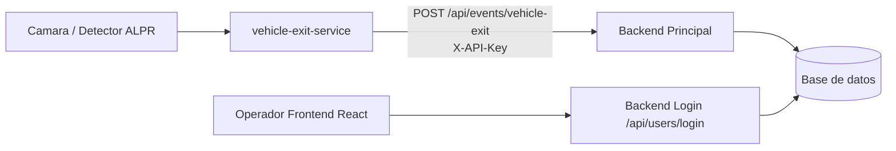
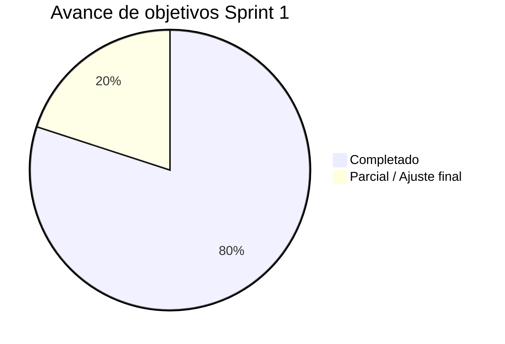

# Sprint Review - Sprint 1 (SIPAR)

## 1. Objetivo del Sprint
Entregar un MVP funcional para autenticacion por roles y deteccion de placas, con integracion de servicios para flujo operativo de parqueadero.

## 2. Incremento entregado
1. Login por roles (admin y operador) en backend.
2. Frontend React para login con validacion y manejo de errores.
3. Microservicio `vehicle-exit-service` para deteccion/recepcion de salida de vehiculos.
4. Integracion SOA entre microservicios usando API Key (`X-API-Key`).
5. Endpoint receptor en backend principal para eventos de salida (`/api/events/vehicle-exit`).

## 3. Historias y tareas del Sprint Backlog
| Item | Descripcion | Estado |
|---|---|---|
| HU-01 | Login administrador | Completado |
| HU-02 | Login operador | Completado |
| HU-03 | Captura automatica placa por camara | Completado (integracion base) |
| HU-04 | Registro manual alternativo | En progreso / depende de flujo operativo final |
| Tecnica | Pruebas unitarias autenticacion | Completado |
| Tecnica | Pruebas unitarias registro/eventos | Completado en `vehicle-exit-service` |

## 4. Grafico de incremento funcional

## 5. Grafico de avance del Sprint

## 6. Criterios de aceptacion (resumen para exponer)
1. Inicio de sesion exitoso con rol administrador: validado.
2. Inicio de sesion exitoso con rol operador: validado.
3. Bloqueo ante credenciales incorrectas: validado (401).
4. Captura automatica y envio al backend: validado por flujo de integracion.
5. Pruebas unitarias ejecutadas: validado.

## 7. Evidencia sugerida para Sprint Review
1. Demo en vivo de login (admin y operador).
2. Intento con credenciales incorrectas mostrando error.
3. Ejecucion de `vehicle-exit-service` con deteccion y log de envio.
4. POST manual a `/api/events/vehicle-exit` con respuesta `accepted: true`.
5. Capturas de pantalla de frontend + logs backend.

## 8. Riesgos / deuda tecnica visible
1. Precision >=95% de ALPR depende de condiciones de camara (luz, angulo, resolucion).
2. Registro manual debe cerrarse de punta a punta con reglas de negocio finales.
3. Persistencia final de evento de salida puede extenderse en proximo sprint segun politica de tickets.

## 9. Guion corto para presentar (3-5 min)
1. Contexto: objetivo del Sprint y valor entregado.
2. Mostrar arquitectura (grafico).
3. Demo login (admin/operador y error de credenciales).
4. Demo de evento de salida automatico/manual hacia backend.
5. Cerrar con resultados, pendientes y plan Sprint 2.
